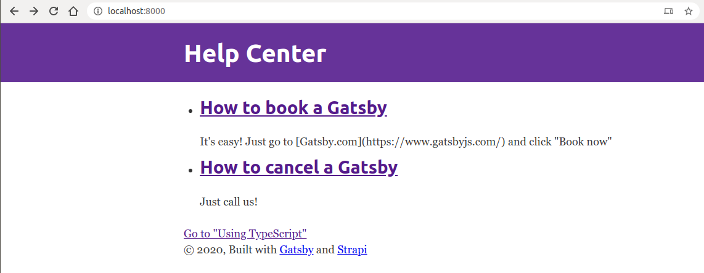

# Help Center

Prototype app built using Gatsby + Strapi

* **Gatsby:** Static Site Generation (the frontend)
* **Strapi:** NodeJS headless CMS (the backend)

Created following this tutorial:
https://strapi.io/blog/building-a-static-website-using-gatsby-and-strapi#1introduction

## Installation

```
# backend
cd backend
yarn
yarn start

# frontend
cd frontend
npm install --global gatsby-cli
yarn
gatsby develop
```

## Usage

Backend:
```
# GET localhost:1337/articles
[
  {
    "id": 1,
    "title": "How to book a Gatsby",
    "content": "It's easy! Just go to [Gatsby.com](https://www.gatsbyjs.com/) and click \"Book now\"",
    "created_at": "2020-08-15T23:04:40.295Z",
    "updated_at": "2020-08-15T23:04:40.303Z"
  },
  {
    "id": 2,
    "title": "How to cancel a Gatsby",
    "content": "Just call us!",
    "created_at": "2020-08-15T23:04:53.881Z",
    "updated_at": "2020-08-15T23:04:53.888Z"
  }
]
```

Frontend:
